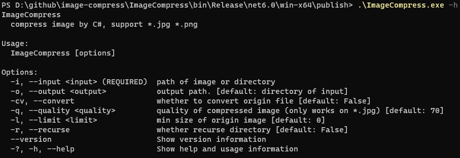

# `Image Compress`

compress image for <font color="#CCC0DA">jpg</font> <font color="#D8E4BC">jpeg</font> <font color="#1C74A6">png</font> 

## build & publish & run

- make sure .net 6.0 sdk installed

- build

  ``` cmd 
  cd ./ImageCompress
  
  dotnet build
  ```
- publish
  
  [publish.cmd](./publish.cmd)

- run in terminal
  
  example for windows

  

## unfortunately

- mac and linux need gdiplus lib

- -q or --quality just effect on jpg / jpeg
- .net publish PublishTrimmed option has some bug for assembly System.Common.Drawing .
  if you have any idea ,please tell me .